

# HamoniKR OS Wallpaper

## For HamoniKR
<table>
  <tr>
    <td></td>
    <td><a href="usr/share/backgrounds/hamonikr/bg11.jpg">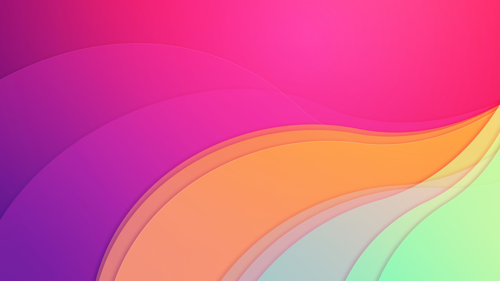</a></td>    
    <td><a href="usr/share/backgrounds/hamonikr/bg8.jpg">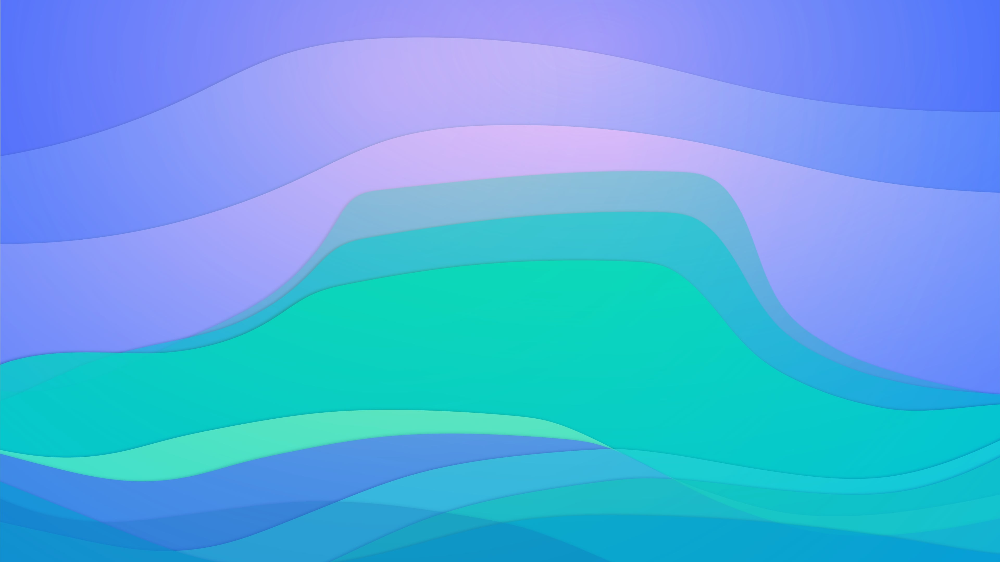</a></td>    
    <td><a href="usr/share/backgrounds/hamonikr/bg7.jpg">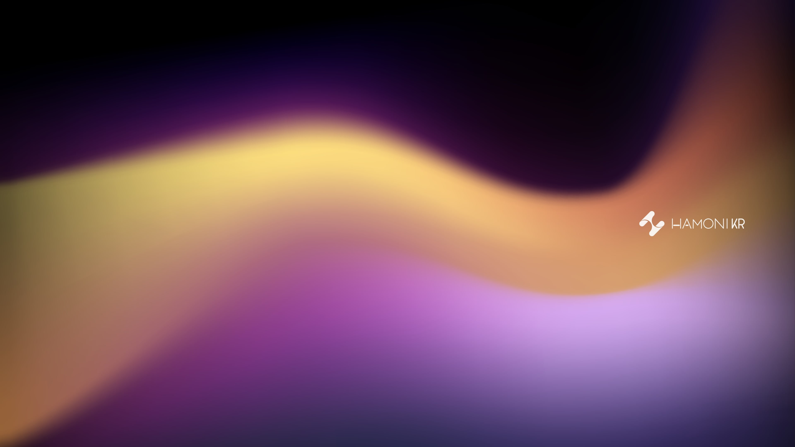</a></td>    
  </tr>
</table>

## For WQHD
<table>
  <tr>
    <td></td>
    <td></td>    
    <td></td>    
    <td><a href="usr/share/backgrounds/WQHD/WQHD_04.jpg">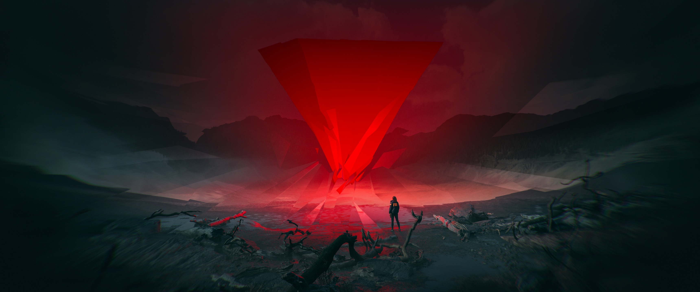</a></td>    
  </tr>
  <tr>
    <td></td>
    <td><a href="usr/share/backgrounds/WQHD/WQHD_06.jpg">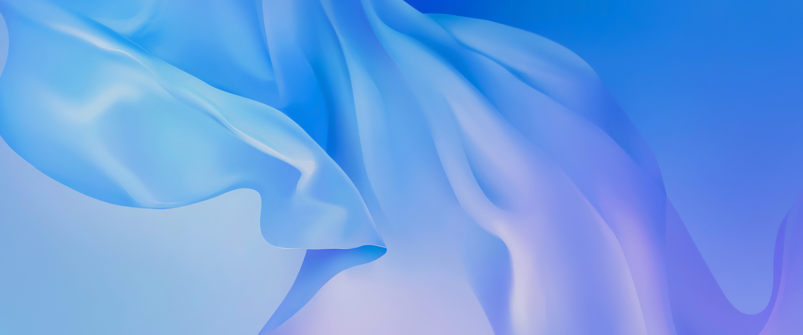</a></td>    
    <td><a href="usr/share/backgrounds/WQHD/WQHD_07.jpg">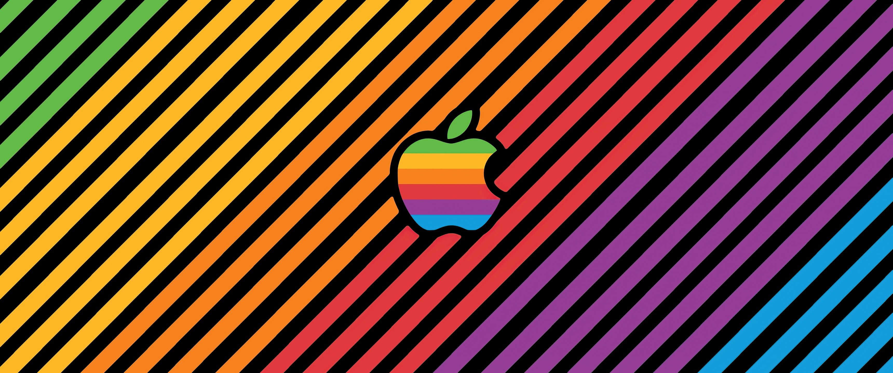</a></td>    
    <td><a href="usr/share/backgrounds/WQHD/WQHD_08.jpg">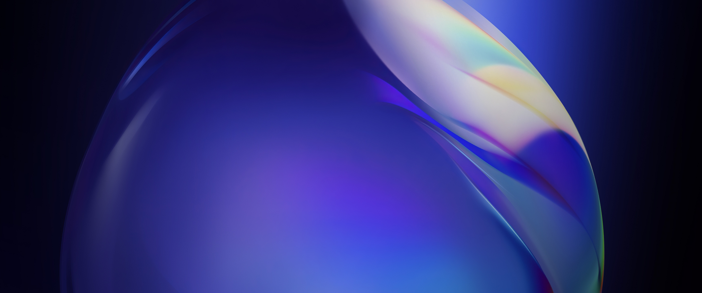</a></td>    
  </tr>
  <tr>
    <td><a href="usr/share/backgrounds/WQHD/WQHD_09.jpg">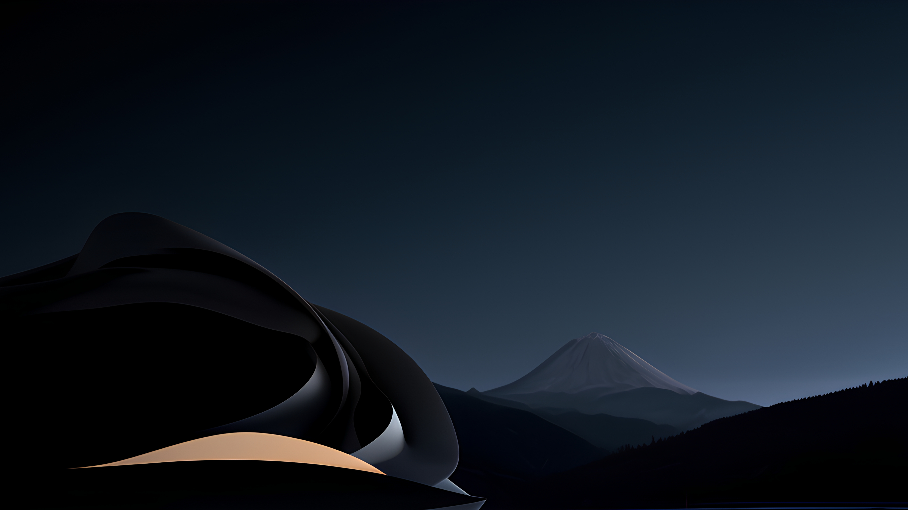</a></td>
    <td></td>    
    <td><a href="usr/share/backgrounds/WQHD/WQHD_11.jpg">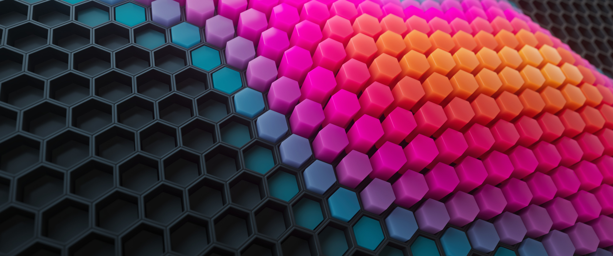</a></td>    
    <td><a href="usr/share/backgrounds/WQHD/WQHD_12.jpg">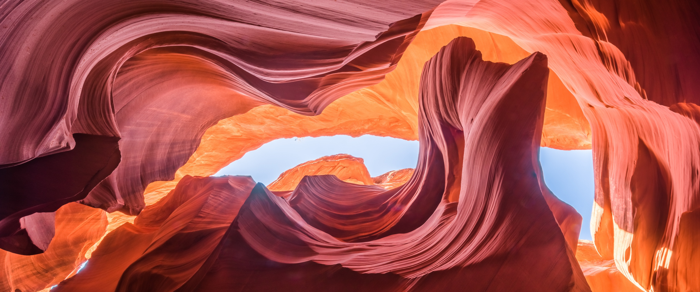</a></td>    
  </tr>
  <tr>
    <td><a href="usr/share/backgrounds/WQHD/WQHD_13.jpg">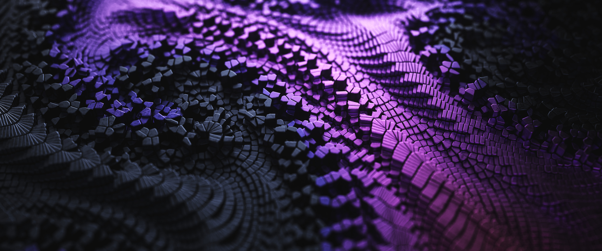</a></td>
    <td></td>    
    <td></td>    
    <td></td>    
  </tr>  
  <tr>
    <td></td>
    <td><a href="usr/share/backgrounds/WQHD/WQHD_18.jpg">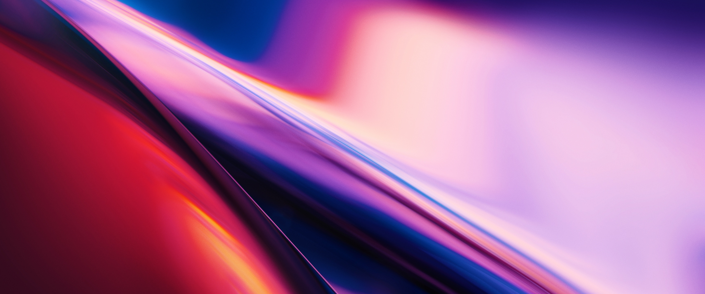</a></td>    
    <td><a href="usr/share/backgrounds/WQHD/WQHD_19.jpg">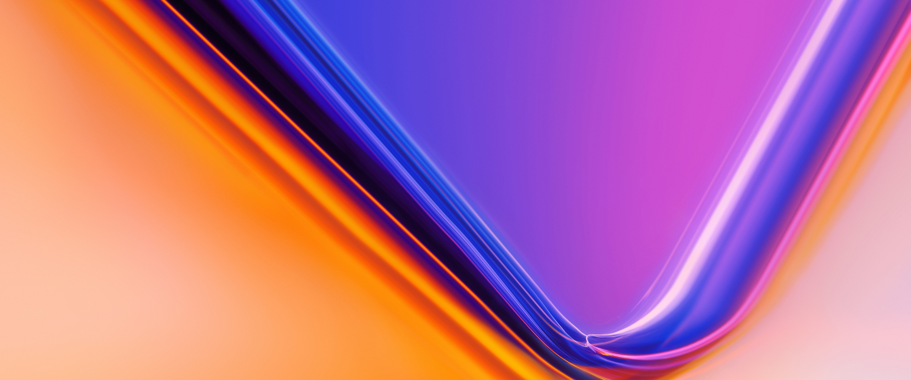</a></td>    
    <td><a href="usr/share/backgrounds/WQHD/WQHD_20.jpg">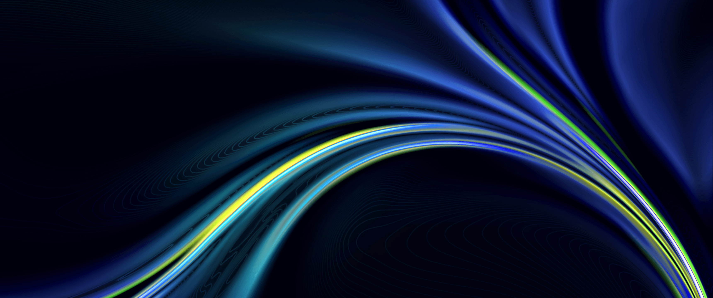</a></td>    
  </tr>
</table>

## LICENSE
This project follows the MIT license.See the [LICENSE](LICENSE) file for more information.